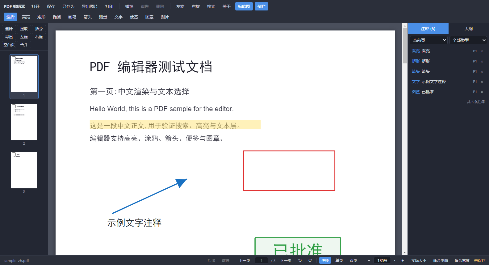
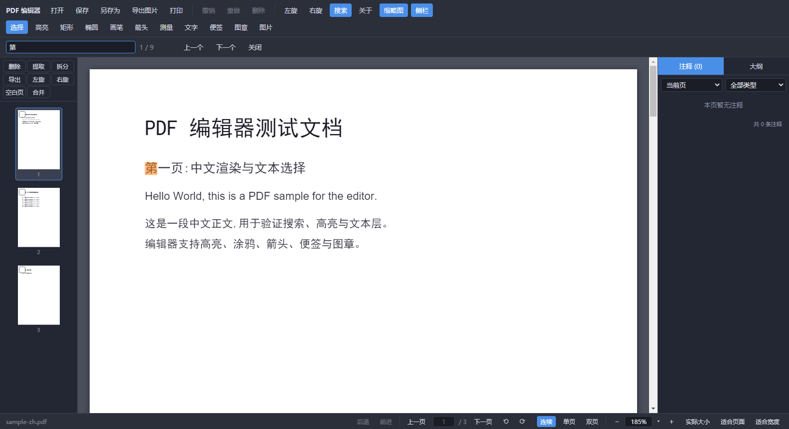
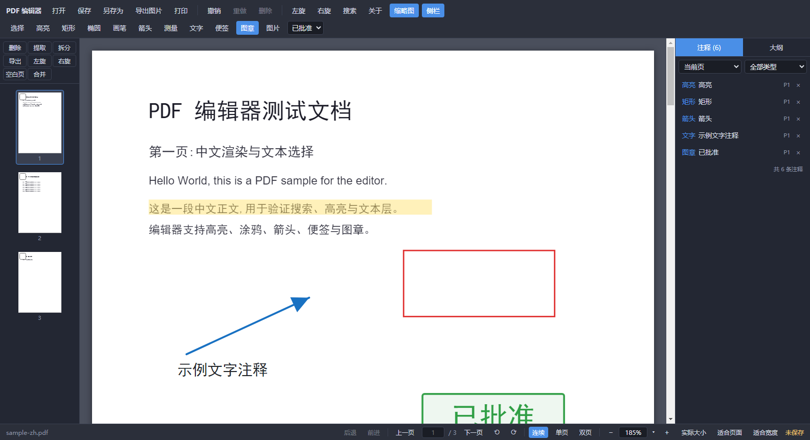
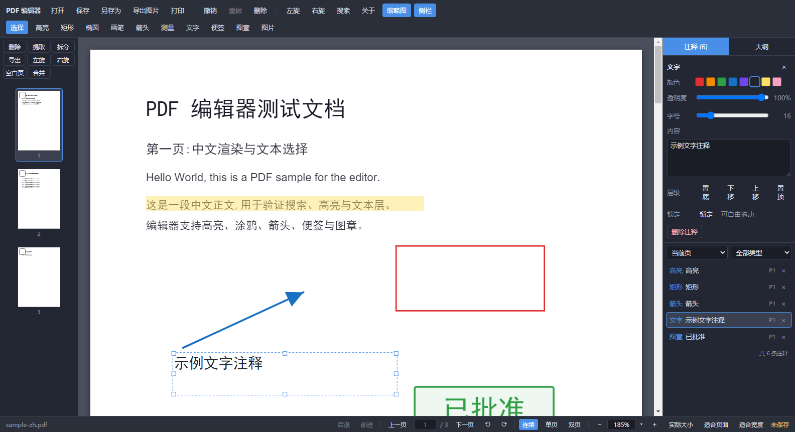
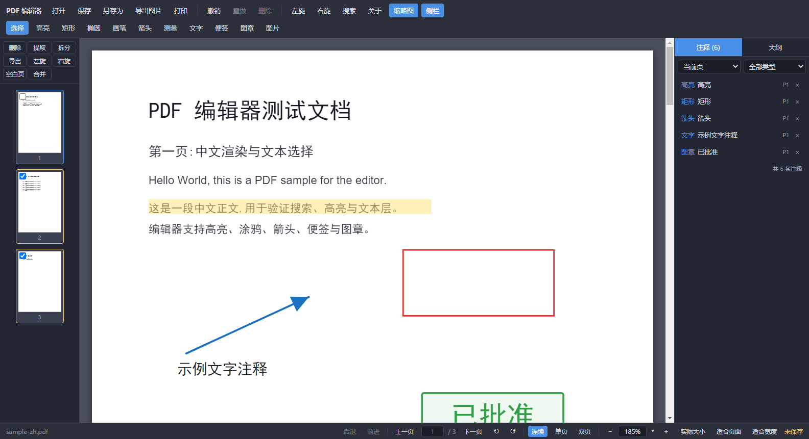
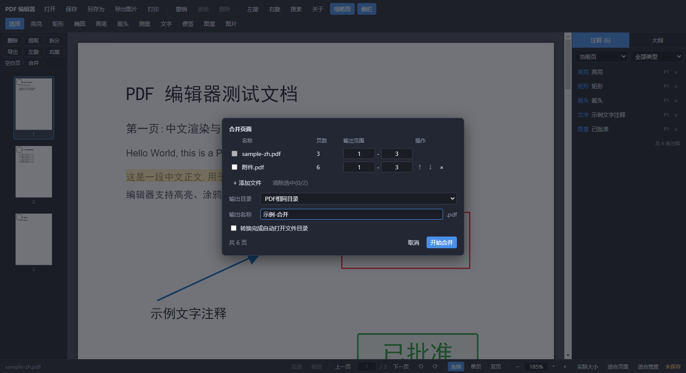
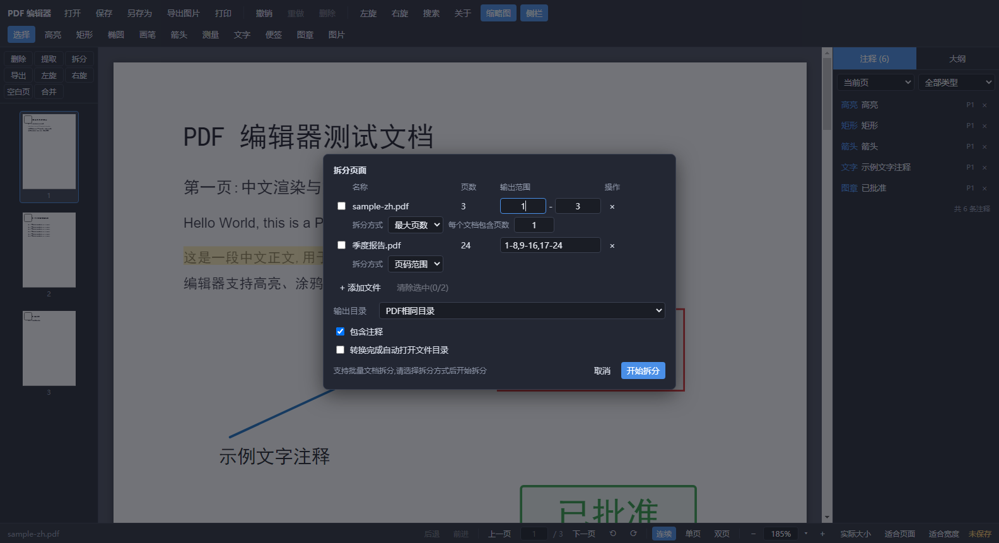
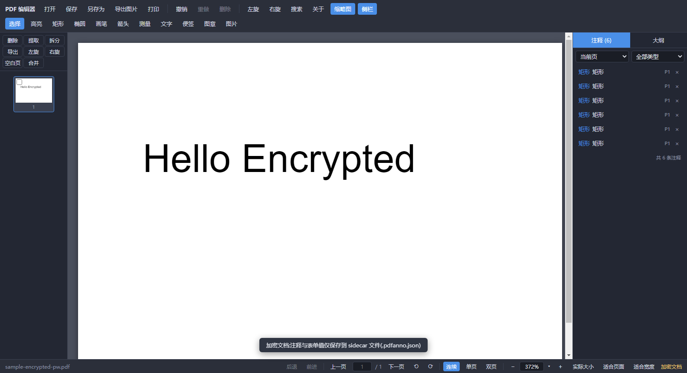
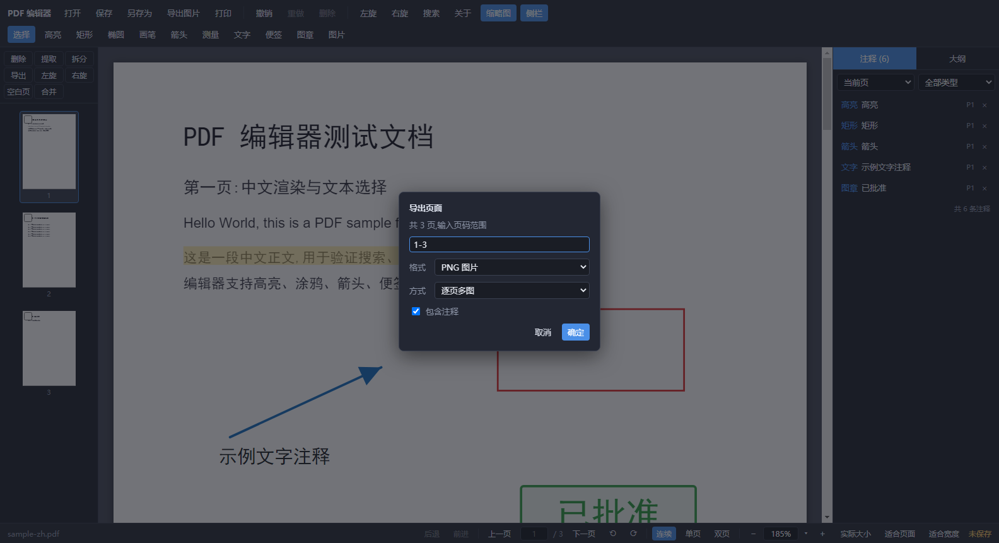

# PDF 编辑器 操作手册

基于 Electron 的 Windows 桌面 PDF 阅读与标注编辑器。

---

## 1. 安装与启动

| 方式 | 文件 | 说明 |
|---|---|---|
| 安装版 | `pdf-editor-setup-<版本>-<平台>.exe` | 双击安装,可选安装目录、自动创建桌面快捷方式 |
| 便携版 | `pdf-editor-portable-<版本>-<平台>.exe` | 免安装,双击直接运行 |

平台四种组合:**Win7-32 位 / Win7-64 位 / Win10-32 位 / Win10-64 位**。
下载地址:https://github.com/KongValley/PDFEditor/releases (建议选 `Latest` 一版)。
Win7 与 Win10 两套名称的构建内容相同(同为 Electron 22,仅按 32/64 位架构区分),两边的系统都可安装;32 位系统选 32 位包,64 位系统两种均可。

**Windows 7 前置要求**:需 **Windows 7 SP1**,并按下表补齐补丁(内网机器若长期未更新,先补再装);内网分发的安装包文件夹里已附带「前置补丁」子文件夹(32 位目录放 x86、64 位目录放 x64,含各 `.msu` 与《安装说明.txt》);从 GitHub 下载的机器按下表自行补装:

| 补丁 | 必要性 | 官方下载地址 | 作用 |
|---|---|---|---|
| KB2533623 | 强烈建议 | [KB2533623 支持页(含 x86/x64 下载入口)](https://support.microsoft.com/kb/2533623) | 提供 DLL 安全加载 API(`SetDefaultDllDirectories`);缺失时应用按旧式加载运行,老系统若报「无法定位程序输入点…KERNEL32.dll」补装它即可 |
| KB2670838 | 推荐 | [x86+x64](https://www.microsoft.com/en-us/download/details.aspx?id=36805) | Windows 7 平台更新(DirectWrite 1.1);未装时页面文字可能渲染模糊 |
| KB4490628 | 推荐 | [Update Catalog](https://www.catalog.update.microsoft.com/Search.aspx?q=KB4490628) | 维护堆栈(KB4474419 的前置),先装 |
| KB4474419 | 推荐 | [Update Catalog](https://www.catalog.update.microsoft.com/Search.aspx?q=KB4474419) | SHA-2 代码签名支持;企业内网更新分发与签名校验链路需要 |

> 应用完全离线运行,不依赖网络与代码签名验证;补丁需按系统位数分别下载(分发目录中已按架构放好),Win10 及以上系统无此要求。

卸载:控制面板「程序和功能」中卸载;便携版直接删除文件即可。

**可选:硬件加速**。本应用默认关闭硬件加速(面向无 GPU 的内网机器与 32 位老机器,软件光栅更稳)。在装有独立显卡、显卡驱动正常的机器上,可用环境变量 `PDF_EDITOR_HWACCEL=1` 启动以启用硬件加速,渲染吞吐明显更高;若启用后出现黑屏或崩溃,去掉该变量即可恢复默认。

---

## 2. 界面布局

```
┌───────────────────────────────────────────── 工具栏(两行) ──┐
│ 打开 保存 另存为 导出图片 打印 | 撤销 重做 删除 | 视图旋转 搜索 关于 缩略图 侧栏 │
│ 选择 高亮 矩形 椭圆 画笔 箭头 测量 文字 便签 图章 图片                │
├── 缩略图栏 ──┬──────────── 主视图 ────────────┬── 右侧面板 ──┤
│ 删除 提取 拆分│                              │ 注释 (n) / 大纲 │
│ 导出 左旋 右旋│         PDF 页面             │ 属性 / 注释列表 │
│ 空白页 合并   │                              │                │
├──────────────┴──────────────────────────────┴────────────────┤
│ 状态栏:文件名 | 后退/前进 翻页 ⟲⟳ 阅读视图 缩放 | 未保存 | 加密文档   │
└──────────────────────────────────────────────────────────────┘
```

- **状态栏**:左侧为文件名;右侧集中 后退 / 前进、上一页 / 下一页 + 页码输入框、连续 / 单页 / 双页阅读视图、缩放控件(`−` / 可输入百分比 + 常用比例菜单 / `+` / 实际大小 / 适合页面 / 适合宽度)与「未保存 / 加密文档」标记。
- **状态栏「未保存」**:有注释、表单或页面改动后出现,保存后消失。
- **状态栏忙碌提示**:保存 / 拆分 / 合并 / 打印 / 批量导出进行中时显示当前操作与进度(如「拆分中 文件 12/40,已输出 120 个」);此时相关按钮置灰,重复点击会被拒绝而不是并发跑第二份。
- **未打开文档时**:正文区显示「打开文件」按钮与**最近打开**列表(最多 10 条,记录在用户数据目录,单击即按原路径打开并回到上次阅读页)。
- **窗口标题**:显示当前文件名,有未保存改动时追加 `*`(多开时可从任务栏区分)。
- **状态栏「加密文档」**:该文档为加密 PDF,保存行为见第 6 节。
- **关于 / 开源许可**:工具栏右侧「关于」按钮,显示当前版本号与随包附带的开源组件许可清单(Electron / Chromium 的完整声明见安装目录的 `LICENSE.electron.txt` 与 `LICENSES.chromium.html`);`Esc` 或「关闭」退出。



> 图 1:上排是文件、编辑、旋转与搜索操作,底部状态栏集中翻页、阅读视图与缩放控件,下排是 11 种注释工具;左侧缩略图栏管页面,右侧面板管注释与大纲。

---

## 3. 打开与浏览

- **打开**:工具栏「打开」按钮 / `Ctrl+O` / 把 PDF 文件拖到窗口上。
- **打开进度**:大文档读取页面尺寸期间显示「正在读取页面信息 320/400」,此时不渲染空白页面,保存/打印等入口保持禁用,读完后自动进入阅读界面。
- **加密 PDF**:弹出密码框,输错会提示重新输入,取消则不打开该文件(当前已打开的文档不受影响)。
- **翻页**:状态栏上一页/下一页按钮、状态栏页码输入框(回车跳转)、缩略图点击、`←` `→` `Home` `End` `PageUp` `PageDown`。
- **前进 / 后退**:状态栏「后退 / 前进」按钮或 `Alt+←` `Alt+→`,按访问过的页码历史回退与前进(滚动/翻页停下约 0.7 秒记一条,最多 100 条;换文档后清空)。
- **阅读位置**:重新打开同一文件会自动回到上次阅读页(第 1 页除外),并提示「已回到上次阅读位置」。
- **打印**:工具栏「打印」或 `Ctrl+P` → 输入页码范围、选择清晰度(标准 ≈150dpi / 高清 ≈300dpi)、勾选是否包含注释 → 系统打印对话框(可选择任意已安装打印机,或选「Microsoft Print to PDF」输出 PDF);渲染时提示「正在渲染打印页面 x / N…」,每页按文档页尺寸整页输出。物理内存 ≤4GB 的机器会自动把高清降为标准清晰度并提示(高清单页位图约 33MB)。
- **阅读视图**:状态栏「连续 / 单页 / 双页」切换——**连续阅读**纵向滚动全部页面;**单页阅览**一次一页并居中显示(页面装得下时滚轮直接翻页,放大后滚到页底/页顶再滚即翻页);**双页阅览**每行两页(1-2 / 3-4 / 5-6),行内连续滚动,上一页/下一页与 `PageUp` `PageDown` 按整行步进。模式选择跨文档保留。慢机上双页并发渲染较多,页面渲染超时会自动退避重试;若连续重试仍失败,该页保持空白并在控制台记录(滚一下或切一下视图即可重试),不会显示成「看起来正常的空白页」。
- **缩放**:状态栏 `+` / `−`、可输入的百分比框(输入 25–400 后回车或失焦生效,非法输入回显当前值;点击自动全选)、常用比例菜单(`▾`,25%–300%,当前比例高亮)与 实际大小(1:1)/ 适合页面 / 适合宽度;`Ctrl+滚轮` 以光标为锚点缩放;范围 25%–400%;`Ctrl+0` 适合宽度。双页模式下适合页面 / 适合宽度按整行(摊开的两页)计算。
- **平移**:按住 `空格` 拖动,或按住鼠标中键拖动。
- **视图旋转**:工具栏左旋/右旋(仅改变屏幕显示方向,不修改文件)。
- **页面旋转**(修改页面本身,可撤销):三种入口 —— ① 缩略图栏「左旋 / 右旋」(勾选缩略图则作用于勾选页,否则当前页);② 状态栏 `⟲` / `⟳` 按钮旋转当前页;③ 在主视图页面或缩略图上**右键**弹出菜单(旋转 / 插入空白页 / 删除 / 提取 / 导出该页)。快捷键 `[` / `]` 旋转当前页。
- **面板显隐**:工具栏「缩略图」「侧栏」按钮,或 `Ctrl+B` / `Ctrl+Shift+B`。
- **搜索**:`Ctrl+F` 打开搜索栏,输入后回车搜索;命中最多 200 条、超出显示 `+` 号;`Enter`/`F3` 下一条,`Shift+F3` 上一条;命中在页面上以黄色高亮、当前命中为橙色。



> 图 2:输入关键词后 300ms 自动搜索,计数显示「当前命中 / 总命中」(如 `1 / 9`),页面上的命中会同步高亮并随 `F3` 滚动跳转。

---

## 4. 注释编辑

### 4.1 工具



> 图 3:第二行按钮即全部注释工具;选「图章」时右侧会出现样式下拉框(已批准 / 作废 / 审核中 / 待复核 / 已归档 / 机密),当前生效的工具会高亮。

| 工具 | 用法 |
|---|---|
| 选择 | 单击选中;`Shift` 单击多选;拖动移动;拖动四角/边手柄缩放;方向键等翻页键不受影响 |
| 高亮 | 在文本层上**划选**文字自动贴合行;或在空白处拖拽框选 |
| 矩形 / 椭圆 | 拖拽绘制;线宽、颜色、透明度可调 |
| 画笔 | 按住拖动自由绘制,松开自动平滑简化 |
| 箭头 | 从起点拖到终点;端点可用圆点手柄调整 |
| 测量 | 拖拽测距离,标签显示 `n mm`;端点可调整 |
| 文字 | 单击放置后弹出输入框,`Ctrl+Enter` 或点击别处提交;内容为空会自动删除该注释 |
| 便签 | 单击放置黄色便签,双击可再次编辑内容 |
| 图章 | 先在工具栏下拉选图章样式(已批准 / 作废 / 审核中 / 待复核 / 已归档 / 机密),再在页面单击放置 |
| 图片 | 单击后选择 PNG/JPEG,插入到该位置;图片文件路径会被记录,重开文档时自动恢复 |

绘制类工具在画完后自动切回「选择」。按 `Esc` 可随时切回「选择」并关闭搜索栏。

### 4.2 选中与属性面板

选中一条注释后,画布上出现蓝色控制框与 8 个缩放手柄,右侧「属性」面板可调整:



> 图 4:选中文字注释后的状态——控制框可拖动/缩放,属性面板依次为颜色、透明度、字号、内容、层级(置底/下移/上移/置顶,按同页邻居自动禁用)、锁定与删除。

- **颜色**:8 色调色板。
- **透明度**:滑块 10%–100%。
- **线宽**:矩形/椭圆/画笔/箭头/测量可用。
- **字号**:文字/图章可用。
- **内容**:文字与便签可直接改文本(拖动滑块或连续输入期间不写历史,松手/失焦后合并为**一条**撤销记录)。
- **层级**:置底 / 下移 / 上移 / 置顶。层级只在**同一页**内比较,按钮会按当前同页邻居自动禁用。
- **锁定**:锁定后画布上不可拖动、缩放、双击编辑;属性面板仍可改样式或解锁。
- **删除注释**:删除当前选中的一条。

### 4.3 注释列表与调色板之外的操作

- 右侧「注释」页签列出注释,可按**当前页/全部页**与**注释类型**筛选;单击定位并选中,`Shift` 单击多选,行尾 `×` 直接删除。
- **剪贴板**:`Ctrl+C` 复制、`Ctrl+V` 粘贴到当前页(偏移 12pt)、`Ctrl+D` 原地再制。
- **框选提示**:在「选择」工具下点击页面空白处会取消选中。

### 4.4 撤销与重做

- `Ctrl+Z` 撤销、`Ctrl+Y`(或 `Ctrl+Shift+Z`)重做,按钮在工具栏。
- 注释类操作最多保留 100 条历史;页面操作(删除/旋转/插入/移动/合并)最多保留 5 条,与主进程内存快照配对。
- **超过 128MB 的大文档不记页面快照**:此时做页面操作会提示「文档较大,该操作不可撤销」,请先另存备份。
- 页面撤销/重做若失败(例如快照已被淘汰),会保留现场并提示,不会丢注释。

---

## 5. 页面管理(缩略图栏)



> 图 5:缩略图栏顶部 8 个按钮管页面操作;勾选页面后可对选中页批量左旋/右旋、删除;拖动缩略图即可调整页序。

工具栏两行,共 8 个按钮:

| 按钮 | 说明 |
|---|---|
| 删除 | 按页码范围删除(删完后可用 `Ctrl+Z` 撤销) |
| 提取 | 按页码范围**复制**为新 PDF,原文档不变 |
| 拆分 | 打开批量拆分对话框(见 5.2) |
| 导出 | 按范围导出:PDF / PNG 逐页多图 / PNG 拼接长图(见 6.3) |
| 左旋 / 右旋 | 旋转页面自身(勾选缩略图 → 对勾选页;否则对当前页) |
| 空白页 | 在当前页之后插入一页同尺寸空白页 |
| 合并 | 打开合并对话框(见 5.1) |

**拖拽排序**:直接拖动缩略图到目标位置即可移动页面,松开后按落点半区决定插入到目标页之前/之后。拖动中被拖的缩略图会变淡、目标位置显示蓝色插入线;拖到列表上/下边缘时列表会自动滚动,便于在长文档中跨页搬运。页面顺序变化后视图**保持当前滚动位置**(不会跳回顶部)。

### 5.1 合并对话框



> 图 6:第 1 行是当前文档(整份参与,不可取消选择);已追加文件可各自指定页码范围并用 ↑ ↓ 调整顺序;输出名称、输出目录与「转换完成自动打开文件目录」都在下方设置。

- 第 1 行是当前文档(不可取消选择、不可改范围,整份参与合并)。
- 「+ 添加文件」追加其它 PDF;每行可填**输出范围**(如 `1-3,5`),用 `↑ ↓ ×` 调整顺序或删除。
- **输出目录**:默认「PDF相同目录」,也可「选择目录…」;目录不存在会自动创建。
- **输出名称**:默认 `<原文件名>-合并`;**重名自动改名**(追加 `-1`、`-2`…),不会覆盖已有文件。
- **转换完成自动打开文件目录**:勾选后结束后打开输出所在目录。
- 「开始合并」按钮会实时校验页码范围,无效时置灰。
- 合并完成后编辑器会切到合并结果文件;`Ctrl+Z` 可撤销本次合并(含输出文件之前的编辑现场)。

### 5.2 拆分对话框



> 图 7:每行一个文档,可分别选择「最大页数」或「页码范围」;下方统一设置输出目录、「包含注释」与「转换完成自动打开文件目录」。

- 支持批量:当前文档 + 追加的其它 PDF,每行独立设置。
- **拆分方式**:
  - 最大页数:填「输出范围」(1-based 闭区间)+「每个文档包含页数」,按固定页数切块;
  - 页码范围:填 `1-3,5-7`,按**连续段**切块(逗号分隔的连续段各自成文件)。
- **输出目录**:同上,默认 PDF 相同目录,可另选或新建。
- **包含注释**:默认勾选(见第 6 节说明)。
- **转换完成自动打开文件目录**:勾选后结束后打开首个输出所在目录。
- 每行「输出范围」无效会红框提示且「开始拆分」置灰;单个文件失败不会中断其它文件,失败提示会带文件名与原因。
- **进度与停止**:点击「开始拆分」后对话框切换为进度视图(已处理文件数 / 总文件数,已输出文件数);点「停止」会在下一个文件边界停下,**已经写出的文件保留**,可继续用剩余文件重新发起。
- 输出文件名 `<原名>-1.pdf`、`-2.pdf`…,重名自动追加 `-1`(`-1-1.pdf`)。

---

## 6. 保存与导出

### 6.1 保存

- **保存**(`Ctrl+S`):直接写回当前文件路径。
- **另存为**(`Ctrl+Shift+S`):弹保存对话框,默认路径为当前文件(同目录同名),请按需改名,避免覆盖原文件。
- **提取 / 导出**的保存对话框默认名会自动避让重名(如 `xxx-提取-1.pdf`)且定位在当前文档目录,不会覆盖已有文件。
- **原子写入**:先写临时文件再替换,中途失败(磁盘满、被占用等)原文件保持完好。
- 保存前会先把画布上正在编辑的文字内容并入文档,不会漏掉最后一次编辑。
- 保存过程中的非致命提示(中文字体缺失、图片文件丢失等)会汇总成一条消息并打印到控制台。

**注释的存储方式(重要)**

- 明文 PDF:注释写入 **PDF 批注对象**(`/Annots` + 外观流),因此
  - 用 Adobe Reader、Edge/Chrome、Foxit 等其它阅读器打开**能看到注释**;
  - 删除、修改后再保存**不会叠加、不会残留鬼影**;
  - 同一文件重复保存体积稳定。
  - 同名 sidecar 文件 `xxx.pdfanno.json` 仍会生成,但其中 `annotations` 为空,只保留表单值。
- 加密 PDF:无法改写原文件,**注释与表单值只保存到 sidecar 文件** `xxx.pdfanno.json`,保存后会提示这一点。请把 sidecar 与 PDF 放在一起再拷贝/分发。



> 图 9:打开加密 PDF 需先输入密码;保存后状态栏显示「加密文档」,底部提示注释与表单值写入了同名 sidecar 文件。

- **旧版本文件**:此前版本把注释「烘焙」进页面内容的文件,重开时若存在 sidecar,注释会恢复为可编辑对象、下次保存起转为真实批注对象;但页面上**已经烘焙进去的旧痕迹无法移除**(仅影响这类历史文件,新文件不会再有此问题)。

### 6.2 PDF 导出

- **提取**(缩略图栏)与**导出 → PDF**:把页码范围复制成新的 PDF(保存对话框确认路径);原文档不受影响。
- **删除**(缩略图栏)是修改当前文档;删除完成后提示「已删除 N 页,可用 Ctrl+Z 撤销」。**能否撤销取决于文档大小**:超过 128MB 的文档不记录页面快照,此时改为提示「文档较大,该操作不可撤销」,建议先「另存为」备份。
- 提取/导出的页码对话框中勾选「包含注释」时会:保留其它软件写入的外来批注,并按输出页序重建本应用的注释;**不勾选则输出纯净页面**(剥离全部批注)。

### 6.3 图片导出

- **导出图片**(`Ctrl+E`):把**当前页**按 2 倍分辨率导出 PNG,并与当前注释一起绘制。
- **导出 → PNG** 支持两种方式:



> 图 8:导出对话框输入页码范围后选择格式与方式;PNG 长图模式还会出现方向选项;「包含注释」默认勾选。

  - 逐页多图:每页一张 PNG,选择保存目录后批量写出,重名自动追加 `-1`、`-2`…;
  - 拼接长图:多页拼成一张长图,可选纵向(上下)或横向(左右)。
- **长图的上限与自动降档**:拼接图受画布单边 65535 像素限制。页数较多时会按「整页数 × 位图内存」预算自动下调分辨率(100 页 A4 纵向 → 50%),并提示实际百分比;连最低档仍放不下时提示「请缩小页码范围」,不会静默失败。
- **批量多图的上限**:逐页多图会在内存里累积每页的 base64,页数过多时会提示「请分批导出」而不是把内存撑爆。
- 页码范围对话框中的「包含注释」对 PNG 同样生效:勾选时图片上会绘制矩形/高亮/画笔/箭头/测量/文字/便签/图章/图片等注释;不勾选为纯页面。

---

## 7. 快捷键一览

| 快捷键 | 功能 |
|---|---|
| `Ctrl+O` | 打开 PDF |
| `Ctrl+S` / `Ctrl+Shift+S` | 保存 / 另存为 |
| `Ctrl+E` | 导出当前页为 PNG |
| `Ctrl+P` | 打印(页码范围对话框) |
| `Ctrl+F` | 打开/关闭搜索栏 |
| `Ctrl+=` / `Ctrl+-` | 放大 / 缩小 |
| `Ctrl+0` | 适合宽度 |
| `Ctrl+Z` / `Ctrl+Y` | 撤销 / 重做 |
| `Ctrl+C` / `Ctrl+V` / `Ctrl+D` | 复制 / 粘贴到当前页 / 原地再制 |
| `[` / `]` | 左旋 / 右旋当前页(修改页面本身) |
| `Ctrl+Shift+N` | 在当前页之后插入空白页 |
| `Ctrl+Shift+Delete` | 删除当前页(会弹确认框) |
| `Ctrl+1` / `Ctrl+2` / `Ctrl+3` | 阅读视图:连续 / 单页 / 双页 |
| `Ctrl+B` / `Ctrl+Shift+B` | 显示/隐藏缩略图栏 / 右侧面板 |
| `Delete` / `Backspace` | 删除选中注释 |
| `F3` / `Shift+F3` | 搜索下一个 / 上一个 |
| `F11` | 全屏切换 |
| `Esc` | 关闭搜索栏 / 「关于」对话框,并切回「选择」工具 |
| `←` `→` `Home` `End` `PageUp` `PageDown` | 翻页 |
| `Alt+←` / `Alt+→` | 后退 / 前进 |
| 空格 + 拖动 / 中键拖动 | 平移视图 |

说明:文本输入框、下拉框聚焦时,除 `Ctrl+O`、`Ctrl+S` / `Ctrl+Shift+S`、`F11` 外的**文档级快捷键一律交还给输入控件**——包括 `Ctrl+E` / `Ctrl+P` / `Ctrl+F`、`Ctrl+1/2/3`、`Ctrl+B`、`Ctrl+C/V/D`、`Ctrl+Z`、方向键与 `[`/`]`。这样在文字注释、表单字段或搜索框里打字时,不会再被弹出的对话框或视图切换打断(也避免 `Ctrl+V` 同时粘贴系统文本与批注)。`Ctrl+O/S`、`F11` 保留为全局可用。关闭窗口时若有未保存更改会弹出确认框。

页码范围对话框(打印 / 提取 / 导出 / 删除)输入时实时校验:有效显示「将处理 N 页」,无效红框并禁用「确定」;`Enter` 确认、`Esc` 关闭在输入框与下拉框上都生效。

---

## 8. 常见问题

**Q:换文档后注释数量不对/看不到注释?**
本版本从 PDF 内部的批注对象读取注释;如果文件是其它软件写入的批注,本应用不负责编辑/显示这类外来批注(但保存时会原样保留,不破坏)。

**Q:保存后 PDF 体积变大?**
重复保存不会持续增长。若首次保存后体积明显增大,通常是嵌入了中文字体子集(文字/图章注释需要),属正常。

**Q:提示「文档较大,该操作不可撤销」?**
文档超过 128MB 时不记录页面快照。请先「另存为」备份,再做页面增删改。

**Q:「未保存」标记一直不消失?**
保存对话框被取消不会清标记;另外保存期间若又产生新编辑,标记会保留(避免把新编辑误标为已保存)。再按一次 `Ctrl+S` 即可。

**Q:加密文档保存后找不到注释?**
加密文档只能写 sidecar(`xxx.pdfanno.json`)。分发文件时请把 PDF 与 sidecar 一起拷贝,或先用其它工具解除加密后再用本应用编辑。

**Q:图片注释显示为空白?**
图片注释保存的是磁盘路径引用;原图片文件被移动/删除后无法恢复,重开时会提示「图片注释丢失」。

**Q:在 Windows 7 上双击没反应 / 提示找不到 KERNEL32.dll 的程序输入点?**
系统缺少 KB2533623(未更新或精简版系统未集成)。确认系统为 Windows 7 SP1 后补装 KB2533623;若装好能打开但文字发虚,再装 KB2670838。

**Q:在 Windows 10 上双击安装包弹出「Windows 已保护你的电脑」/ SmartScreen 提示?**
应用 exe 未做代码签名。当安装包带有「下载自互联网」标记(浏览器下载、邮件或 IM 附件等)时,Win10/11 的 SmartScreen 可能拦截,点「更多信息 → 仍要运行」即可;从内网共享或域内分发的文件通常不带该标记,不会触发。需要全局放行时,可由 IT 在 SmartScreen 策略中把本应用加入白名单,或为 exe 申请企业代码签名证书。

---

**Q:在文字注释或表单里打字时,Ctrl+E / Ctrl+P / Ctrl+1 之类没反应了?**
这是有意为之:焦点在输入框内时,除 `Ctrl+O`、`Ctrl+S`、`F11` 外的文档级快捷键都让位给输入控件,避免弹窗或切换视图打断录入。点回页面空白处即可恢复。

**Q:长图导出提示「已自动降到 50% 分辨率」?**
拼接图受画布单边 65535 像素限制,页数多时按整页数与内存预算自动降档以保证能出图。想要原始清晰度就分几次导出更少的页。

**Q:打开大文件时为什么先显示「正在读取页面信息 320/400」而不是直接看到页面?**
需要先拿到每页尺寸才能排出正确的滚动几何。读取期间显示进度而不是空白页面,读完即自动进入阅读界面。

**Q:点「停止」后拆分出来的文件会丢吗?**
不会。停止在下一个文件边界生效,已经写出的文件保留;用剩余页重新发起即可。

**Q:保存/拆分时按钮变灰了?**
长操作执行中入口会被锁定,防止并发跑第二份(例如两批拆分写进同一目录)。状态栏会显示当前操作与进度,结束后自动恢复。

## 9. 数据与隐私

- 应用不联网、不上传任何文档内容。
- 只读打开时不会写任何文件;保存/导出只在用户选择的路径与同名 sidecar 位置写入。
- 缓存策略面向低内存机器:文档缓存 3 份、页面缓存 12 页、图片缓存 20 张,超出自动回收。
- 随包附带第三方开源组件许可清单:应用内「关于 / 开源许可」可查看,安装目录 `resources/THIRD-PARTY-NOTICES.json` 为同一份文件。


## 10. 构建(开发者)

- 依赖全部由 electron-vite 打进 `out/`(主进程只 `require("electron")` 与 node 内置模块),因此 `package.json` 里没有运行时 `dependencies`、所有包都在 `devDependencies`——electron-builder 据此不再把 `node_modules` 打进 `app.asar`(打包体积从 65.5 MB 降到约 6 MB)。
- 若将来改用 `externalizeDepsPlugin` 外置依赖,必须同时把对应包从 `devDependencies` 移回 `dependencies`,否则运行时缺包。
- 本地打包:`npm run dist`(四组合齐跑,输出到 `release/<平台>/`,资产名不含中文);CI 由 `v*` tag 触发同一流程并发布 GitHub Release。